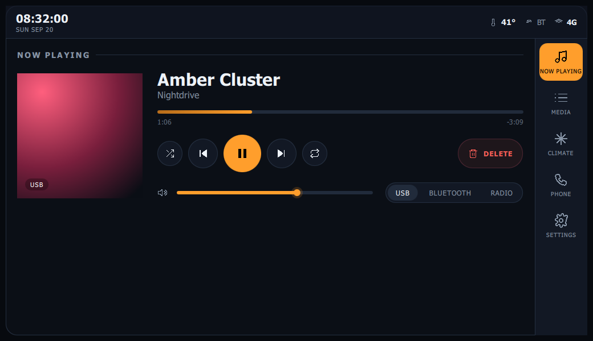
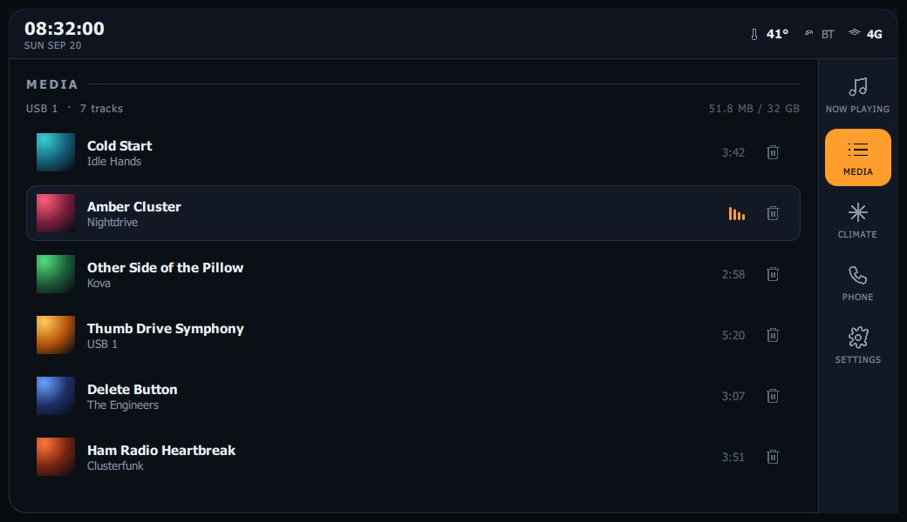
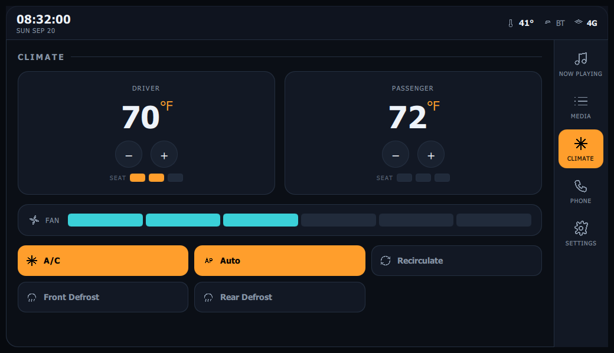
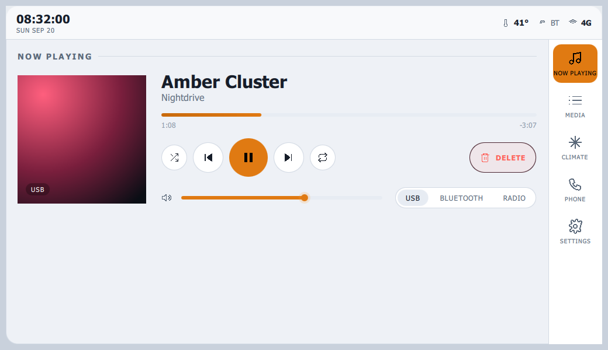

# OpenDash — Qt/QML build

The OpenDash head-unit UI as a real Qt 6 application: **QML for the declarative
UI, C++ for the model and controllers.** This is the stack aftermarket dashes
(OpenAuto / Crankshaft) and most QNX / Automotive-Grade-Linux OEM head units
are actually built in — Qt Quick over a C++ backend.

## Architecture

```
qt/
├── CMakeLists.txt          # Qt 6 + qt_add_qml_module build
├── src/                    # C++ backend
│   ├── main.cpp            # engine bootstrap; exposes the backend to QML
│   ├── mediamodel.*        # QAbstractListModel — the USB library
│   ├── playbackcontroller.* # transport + 1 Hz QTimer position tick
│   ├── climatecontroller.*  # dual-zone HVAC state
│   └── dash.*              # app shell: view routing, night/day, live clock
└── qml/                    # declarative UI
    ├── Main.qml            # the head unit: status bar + content + nav rail
    ├── Theme.qml           # design tokens (singleton), night/day palette
    ├── Icons.qml           # SVG path data (singleton)
    ├── DashIcon / AlbumArt / ViewHeading / TransportButton / Toast
    └── NowPlaying / Media / Climate / Phone / Settings
```

The split is the point: the **delete button** removes a row from a real
`QAbstractListModel` (`MediaModel::removeAt`), not from a view. The controllers
expose `Q_PROPERTY` / `Q_INVOKABLE` surfaces that a production HMI would wire to
CAN-bus and a real audio backend; here they hold state and drive the same UI.

## Build & run

Needs Qt 6.4+ (Core, Gui, Qml, Quick) plus the QtQuick Controls and Shapes QML
modules, CMake 3.21+, and a C++17 compiler.

```bash
cd qt
cmake -S . -B build -DCMAKE_BUILD_TYPE=Release
cmake --build build
./build/opendash            # Windows: build\opendash.exe
```

### Raspberry Pi (Debian / Raspberry Pi OS bookworm)

```bash
sudo apt install cmake g++ qt6-base-dev qt6-declarative-dev \
     qml6-module-qtquick-controls qml6-module-qtquick-shapes \
     qml6-module-qtquick-layouts qml6-module-qtquick-window
cmake -S . -B build && cmake --build build -j4
# kiosk: run fullscreen on the framebuffer / EGLFS
QT_QPA_PLATFORM=eglfs ./build/opendash
```

Set the `Window` to `visibility: Window.FullScreen` (or launch under EGLFS) for
a real double-DIN install.

## Fonts

The UI asks for **Chakra Petch** (instrument/numeric) and **Barlow** (body). Drop
the `.ttf` files in `qt/assets/fonts/`, uncomment the `RESOURCES` block in
`CMakeLists.txt` and the loader list in `main.cpp`, and they'll be embedded.
Without them the UI falls back to the platform's condensed + sans fonts.

## Screenshots

Rendered by the real Qt Quick scene graph (see verification below):

| Now Playing | Media | Climate | Day mode |
|---|---|---|---|
|  |  |  |  |

## Build-verification status

- **QML:** every file passes `qmllint` with **0 errors**, and the full UI has
  been **rendered by the actual Qt Quick engine** (via a PySide6 harness that
  supplies stand-ins for the four C++ context objects) — all five views plus the
  night/day theme flip paint correctly. The screenshots above are those renders.
  This caught and fixed two real bugs: a type/context name collision on
  `Climate`, and an invalid `int` assignment that blanked Settings.
- **C++:** written against Qt 6.4 and reviewed, but **not compiled** in the
  session that generated it (no Qt toolchain on that machine). Build it on your
  target — the Pi is the real test — and report anything that doesn't compile.

The PySide6 render harness is a verification aid, not part of the app; the app's
own backend is the C++ under `src/`.
